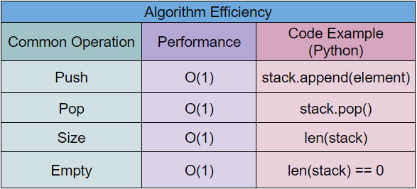

# Stacks
## Introduction
A stack is a simple data structure that has the unique attribute of only allowing the user to access the most recently added element, also known as the Last-In-First-Out order. This style of structure allows very cheap access to the last element as well as adding to the stack. However, it also has its drawbacks. The user will no longer have access to any previously added elements until the ones after it have been removed.

## How To Use A Stack
*The following will show how it is done in python, however, the concepts are the same for any language.
        
In Python, there are no built-in Stacks, so we will be using an array to accomplish the same effect. For stacks, there are 4 main commands/functions that you can use, those being; Push, Pop, Size, and Empty. 

 Push - The Push command allows the user to add an additional element to the stack. It’s like adding an additional piece of paper to a pill of papers. In Python, the push command would look something like this.

Pop - The Pop command allows the user to access the last element in the stack. This can be thought as taking the top sheet of paper from off the file. In Python, the pop command looks like this. Note that the pop command will also remove the element from the stack.

Size -  The Size command returns the total number of elements that are in the stack. The way you would achieve this in Python is by using the length command.

Empty - The Empty command returns a boolean based on whether the stack is empty or not. Python does not have a function for this, so we will have to use a if statement to accomplish this.


## Why To Use A Stack
### Pros
It is very efficient at keeping order of elements and returning them to the user in reverse order.
Adding or removing from a stack is only O(1).

### Cons
It is very hard to access an element in the middle. You would have to keep taking off the end element until you reached what you wanted.
Searching through a stack is also very costly.

## Examples
Back in the day, students would hand in their essays by placing them in a basket on the teacher’s desk. Mr. Smith misses the good ol days, and so he wants a program that simulates that basket for students to submit online. 

``` python
stack = ["Bill","Eric","Jill","Rio","Ryle","Ivy","Jacob"]
answer = -1
print ("Welcome Back Mr. Smith")

while(answer != 0):
    remaining = len(stack)          # Length command
    print("\n******************************")
    print("\t0. Quit")
    print("\t1. Add a student")
    print("\t2. Grade latest paper\n")
    if (remaining != 0):            # Empty command
        print(f"Remaining papers to grade: {remaining}" )
    else:
        print("There are no more papers to grade.")
    answer = int(input("> "))

    if (answer == 1):
        new_student = input("\nThe name of the student:\n\t")
        stack.append(new_student)   # Push Command
    if (answer == 2):
        if (remaining != 0):
            student = stack.pop()   # Pop Command
            print(f"\nYou have graded {student}'s paper")
        else:
            print("\nYou can't grade anymore. You're done!")
```

## Efficiency
Since we are using a dynamic array in python, all of the common commands are very efficient. Adding to, or removing from the end of a dynamic array is O(1). Finding the size of the array is also only O(1). Since there is no empty function, we can use an if statement to check if the length is 0, and since the length function is O(1), empty will also be O(1)

## Efficiency Chart


## Try It Yourself
The company Nerf has released many different types of nerf darts over the years. Many of which can fit inside a standard clip for their blasters. For this problem, we will limit the types of darts to 4; standard, whistler, suction cup, and the flat head dart. The first dart that you load into the magazine will be the last one out. The standard magazine holds up to 6 darts. Create a program that allows the user to input the types of darts they load into the blaster and tell them which one is next in line.

Here is a [template](1.2%20stackNerf_problem.py) to start off from.

Once you are done with the problem, check with the [solution](1.2%20stackNerf_Solution.py).

