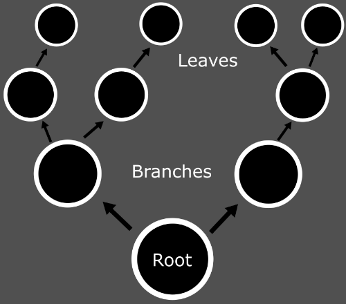
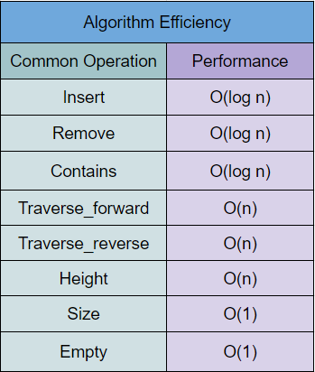

# Trees
Back to [Main](0-welcome.md)
## Introduction
Trees are linked links but with a twist. Instead of having one element in front and behind it, it has one before and many elements after it. For this tutorial, we will be going over binary trees, which contain two child elements, one on the right and one on the left. A tree will start with one element and as you progress up the level on the tree, more and more elements will be there. In order to move around in a tree structure, you will have to use some form of recursion.



## How To Use A Tree
*The following will show how it is done in python, however, the concepts are the same for any language.

Since python does not have either Trees or Linked Lists in the base language, we will have to make it all by hand. There will be code examples in this section since all the functions will have to be created by the user.

Insert - The insert function allows the user to add a new element to the tree. Depending on how the tree is set up, the element will have to travel down a branch of the tree until it has found an empty spot to be stored.

Remove - The remove function allows the user to remove an element from the tree. In order to find the element, you have to climb up the branches until you reach the element that you were wanting to remove.

Contains - The contain function allows the user to search for an element in the tree. This function returns a boolean based on whether or not the element was found.

Traverse_forward/Backwards - The traverse_forward/backward function allows the returns of each element from the tree. Traveling forward through the tree will return the elements starting from the root level and traveling upwards through the tree. Traveling backward will start at the leaves and start heading downwards towards the root. In order to travel through the tree, you have to use recursion to ensure that you have visited each element.

Height - The height function returns height from the longest branch in the tree. It must travel every branch to find the longest one.

Size - The size function returns how many elements are in the tree. This is usually stored inside the tree’s class.

Empty - The empty function returns a boolean based on whether or not the tree is empty. 

## Why To Use A Tree
### Pros
One of the benefits of using a tree is that the values are sorted when they are added to the collection. It can also be very efficient to search for an element inside the collection.

### Cons
One of the problems with using a tree is that it does not keep track of the order of the elements that you added. Depending on the order that you input the elements, the tree could all be down on the same branch, which would then function similarly to a linked list.

## Examples
Mr. Smith enjoys collecting rocks during his summer breaks from teaching. His collection has got too big for his poor mind to keep track of. He wants to create a program that can keep track of all his rocks so he knows whether or not he has already collected them. He has heard about this hip new collection called trees, which already sorts the elements when they are added to the collection and are very efficient at searching through its element. Create a binary tree to help Mr. Smith keep track of his rock collection. 

```python
class Tree:
    class Node:

        def __init__(self, data):

            self.data = data
            self.left = None
            self.right = None

    def __init__(self):
        self.root = None

    def insert(self, data):
        if self.root is None:
            self.root = Tree.Node(data.lower())
        else:
            self._insert(data, self.root) 

    def _insert(self, data, node):
        if data < node.data:
            if node.left is None:
                node.left = Tree.Node(data.lower())
            else:
                self._insert(data, node.left)
        else:
            if node.right is None:
                node.right = Tree.Node(data.lower())
            else:
                self._insert(data, node.right)

    def _contains(self, data):
        return self.contains(data, self.root)

    def contains(self, data, node):
        if node is None:
            return False
        elif data == node.data:
            return True
        elif data < node.data:
            return self.contains(data, node.left)
        else:
            return self.contains(data, node.right)
         
    def __iter__(self):
        yield from self.traverse_forward(self.root) 
        
    def traverse_forward(self, node):
        if node is not None:
            yield from self.traverse_forward(node.left)
            yield node.data
            yield from self.traverse_forward(node.right)

tree = Tree()
tree.insert("Granite")
tree.insert("Diorite")
tree.insert("Sandstone")
tree.insert("Limestone")
tree.insert("Slate")
tree.insert("Obsidian")
tree.insert("Chalk")
tree.insert("Coal")
tree.insert("Pumice")
tree.insert("Basalt")

print("*******************************")
print("What rock are you looking for?")
answer = input("> ")

if (answer.lower() in tree):
    print("You already have that rock. Put it down!")
else:
    print("You don't have that rock. Let's add it to your collection.")
    tree.insert(answer.lower())

```

## Efficiency
*\*These efficiencies are the average efficiency for these functions if the tree is well balanced. If the tree is all on one branch, then some of these functions will be more inefficient.*

The insert, remove, and contains functions each have an efficiency of O(log n). The reason for this is that they will only have to travel down one specific branch to achieve their task. 

The traverse_forward, traverse_backwards, and height functions each have the efficiency of O(n). The reason for it being O(n) is because you are visiting every single element in the tree no matter what. The number of elements will directly impact how long it will take. 

The size and empty functions have an efficiency of O(1). Size is usually stored in the class for the tree, so it is very easy to access. Empty has to check if the root of the tree is an element. It is also very cheap in processing, so it is O(1).


## Efficiency Chart


## Try It Yourself
Mr. Smith really enjoys his rock collecting tree. So much in fact that he wants to create another tree. He wants to create a simple family tree for himself. He has code already made for it, but getting his family members in the right order on the tree is too complex for this poor man. Create Mr. Smith’s family tree with the information provided down below. 

```python
"""
		    Bob     Mr. Smith Senior’s Mom     Mr. Smith Senior’s Dad
		     /                   \                /
	  Mrs. Smith                   Mr. Smith Senior
		        \                /
			    Mr. Smith
"""
```


Here is a [template](3.2treeProblem.py) to start off from.

Once you are done with the problem, check with the [solution](3.2treeSolution.py).

