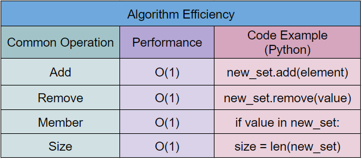

# Trees
Back to [Main](0-welcome.md)
## Introduction


## How To Use A Tree
*The following will show how it is done in python, however, the concepts are the same for any language.

## Why To Use A Tree
### Pros


### Cons


## Examples
When some people want to create change, they will start a petition. Petition usually consist of a list full of people’s names. You aren’t allow to have the same person same multiple times to inflant the numbers. Sets can help preven that issue.
```python
petition = set()
answer = 0

while (answer != 3):
    print("\n----------------------------------")
    print("\t1. Add a name to the petition")
    print("\t2. See list of names")
    print("\t3. Quit")
    answer = int(input("> "))

    if (answer == 1):
        #Add name
        new_name = input("Enter a new name:\n")
        petition.add(new_name.lower())

    if (answer == 2):
        #Display petition
        count = 1
        for name in petition:
            print(f"{count}. {name.lower()}")
            count += 1
```


## Efficiency
Since Set uses hashing to help store its data, it makes the command functions, such as adding and removing O(1). Searching through the set for an element as well as finding the size of the set is also O(1) because of the unique attributes of hashing.

## Efficiency Chart


## Try It Yourself
The youth are always coming up with new terms and lingo that will baffle even the wisest of scholars. Mr Smith wants to be able to stay up to date with what his students are saying. He wants a program to allow his students to create a list of new terms that they use. Each student won’t know what the other student’s have submitted and Mr Smith does not want to have the same term appear multiple times. Create a program to fulfill Mr. Smith’s request.

Here is a [template](2.2SETstudent_dictionary_problem.py) to start off from.

Once you are done with the problem, check with the [solution](2.2SETstudent_dictionary_solution.py).

